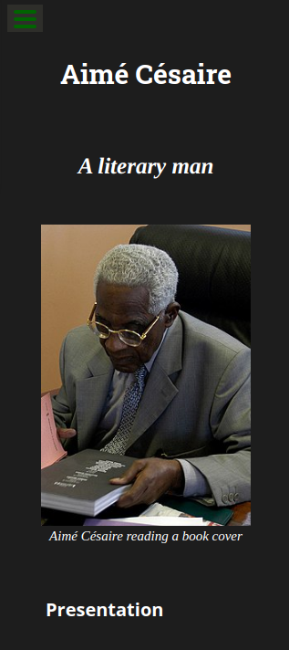
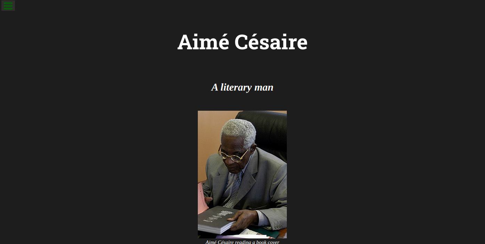

# FCC-Tribute-Page
This project is realized as part of FreeCodeCamp Responsive Web Design project  
## Specifications
See related user stories :  
https://www.freecodecamp.org/learn/responsive-web-design/responsive-web-design-projects/build-a-tribute-page  
## Steps
Here are the steps I followed to organize my work :  
1. Set up structure for files, folders and script for testing
2. Read instructions to make a sketch of what is expected
3. Do the integration  
## Stack
* HTML
* CSS
# Screenshots
Mobile :
 

Desktop :
 

